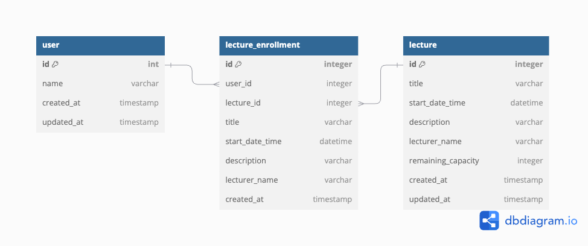

# ERD 설명
## User 테이블
### 속성
- id: 유저 ID (PK)
- name: 유저명
- created_at: 유저 생성 일시
- updated_at: 유저 정보 수정 일시

## Lecture Enrollment 테이블
### 속성
- id: 특강 신청 id (PK)
- user_id: 수강 신청한 유저의 ID (FK, User 테이블의 id를 참조)
- lecture_id: 수강 신청한 특강의 ID (FK, Lecture 테이블의 id를 참조)
- title: 특강명
- start_date_time: 특강 시작 일자 시간
- description: 특강 설명
- lecturer_name: 강사명
- created_at: 수강 신청 생성 일시

## Lecture 테이블
### 속성
- id: 특걍 ID (PK)
- title: 특강명
- start_date_time: 특강 시작 일자 시간
- description: 특강 설명
- lecturer_name: 강사명
- remaining_capacity: 수강 신청 가능한 인원 수
- created_at: 특강 생성 일시
- updated_at: 특강 정보 수정 일시

## 관계
유저(User)는 여러 특강을 수강 신청할 수 있으며, 각 특강(Lecture)은 여러 유저의 수강 신청을 받을 수 있습니다.
그러므로 유저와 특강은 다대다 관계입니다. 
이러한 다대다 관계를 특강 신청(Lecture Enrollment) 테이블에 유저의 id, 특강의 id를 외래키로 두어 해소할 수 있습니다.

## 비정규화 스냅샷 
Lecture Enrollment 테이블에 Lecture 테이블의 정보를 포함하는 것은 스냅샷 개념을 기반으로 한 비정규화 방식으로, 
쓰기 비용을 증가시키지만 상대적으로 쓰기 연산보다 자주 수행되는 읽기 연산의 성능을 향상시킬 수 있습니다.